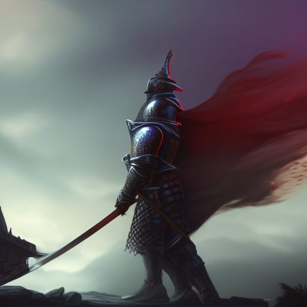
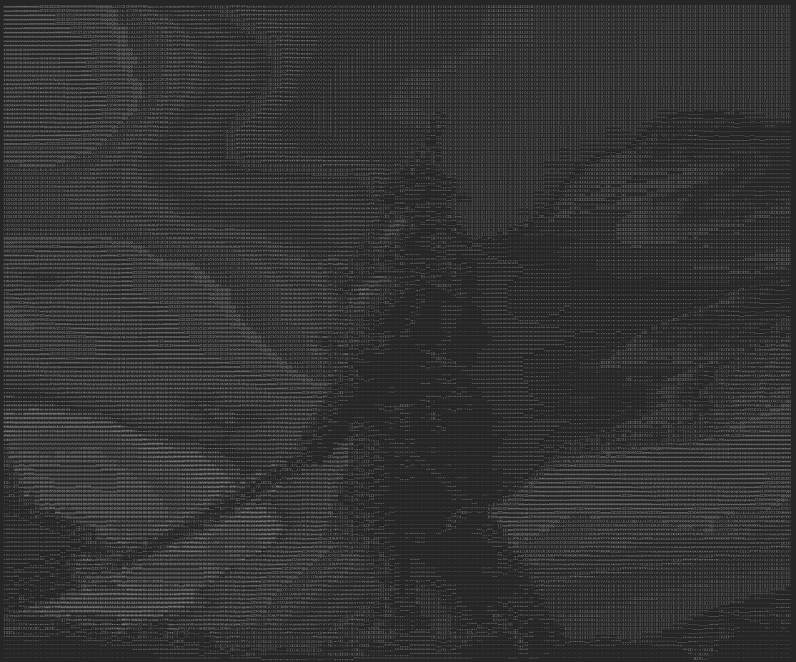

# GolangAsciiArt
## Usage

<pre>Usage of ./asciiImage:
  -contrast int
    	Contrast value to apply to image
  -file string
    	Name of file to turn into ascii art
  -html string
    	print to html file
  -out string
    	name for output to be written
  -print
    	print art to stdout
  -scale float
    	Scaling factor to resize the image (default 1)
</pre>

## Examples
<pre>./asciiImage-amd64.exe -file knight.jpg -contrast 20 -scale 0.3 -out knight.txt -html knight.html</pre>
Sample

Result

## Tips
- Contrast is the best tool to get more defined results
- Contrast flag is a percentage, while the others are multiplication factors
- Scale will usually need to be less than 0.3, as text is much larger than a pixel and most applications can only shrink so far
- the html output needs the tt tags, otherwise it is not monospaced
- the simpler the image, and the higher natural contrast between depth and color makes for a better result
- The sample shown above has good depth clarity, but complex color variation and textures making it a difficult (but doable) sample
- Since most text has a width of height ratio of 1:3, each pixel gets constructed using 3 pieces of text to retain  
